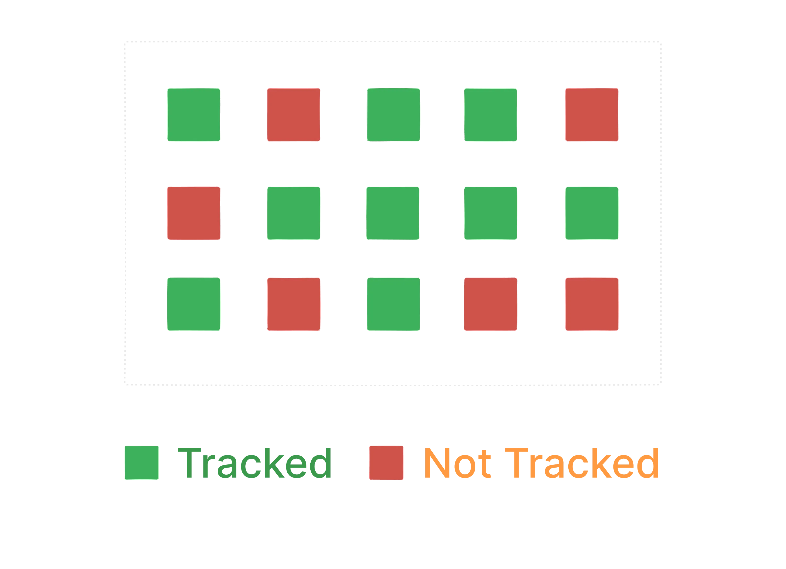
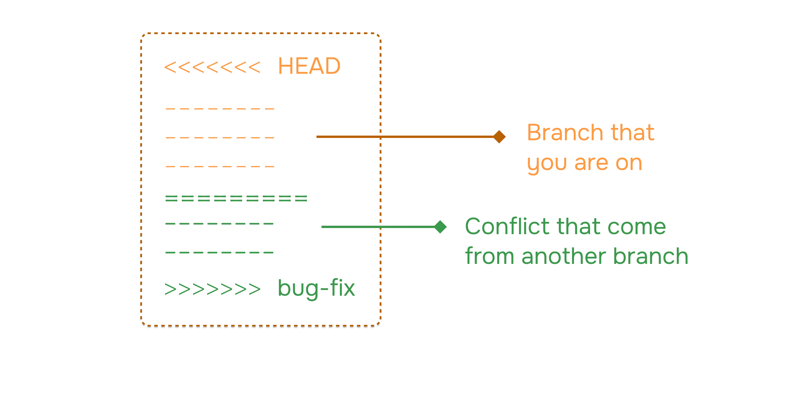

 Git is a version control system that allows you to track changes to your files and collaborate with others
 It is used to manage the history of your code and to merge changes from different branches.

 
 *Git and Github are different*
 Git is a version control system that is used to track changes to your files. It is a free and open-source software that is available for Windows, macOS, and Linux. Remember, GIT is a software and can be installed on your computer.

 Github is a web-based hosting service for Git repositories.
 Github is an online platform that allows you to store and share your code with others. It is a popular platform for developers to collaborate on projects and to share code. 

 *version control systems*
 Version control systems are used to manage the history of your code. 
 They allow you to track changes to your files and to collaborate with others.
Version control systems are essential for software development. Consider version control as a checkpoint in game. You can move to any time in the game and you can always go back to the previous checkpoint. 

Before Git became mainstream, version control systems were used by developers to manage their code. They were called SCCS (Source Code Control System). SCCS was a proprietary software that was used to manage the history of code. It was expensive and not very user-friendly. Git was created to replace SCCS and to make version control more accessible and user-friendly. 

Check your git version
To check your git version, you can run the following command:

Terminal window
git --version (display the version of git installed on your system. Git is a very stable software and don’t get any breaking changes)

you can run the following command to see the current state of your repository:

Terminal window
git status

Your config settings

You can change your username, email, and other settings. Whenever you checkpoint your changes, git will add some information about your such as your username and email to the commit. There is a git config file that stores all the settings that you have changed.

git config --global user.email "your-email@example.com"
git config --global user.name "Your Name"

 check your config settings:

Terminal window
git config --list

This will show you all the settings that you have changed.

git status
git init

git status command will show you the current state of your repository. git init command will create a new folder on your system and initialize it as a git repository. This adds a hidden .git folder to your project.

Commit
commit is a way to save your changes to your repository. It is a way to record your changes and make them permanent. You can think of a commit as a snapshot of your code at a particular point in time. When you commit your changes, you are telling git to save them in a permanent way. This way, you can always go back to that point in time and see what you changed.

When you want to track a new folder, you first use init command to create a new repository. Then you can use add command to add the folder to the repository. After that you can use commit command to save the changes. Finally you can use push command to push the changes to github. 

Stage
Stage is a way to tell git to track a particular file or folder. You can use the following command to stage a file:

Terminal window
git init
git add <file> <file2>
git status

Here we are initializing the repository and adding a file to the repository. Then we can see that the file is now being tracked by git. Currently our files are in staging area, this means that we have not yet committed the changes but are ready to be committed.

Commit
Terminal window
git commit -m "commit message"
git status

Here we are committing the changes to the repository. We can see that the changes are now committed to the repository. The -m flag is used to add a message to the commit. This message is a short description of the changes that were made. You can use this message to remember what the changes were. Missing the -m flag will result in an action that opens your default settings editor, which is usually VIM.

Logs
Terminal window
git log

This command will show you the history of your repository. It will show you all the commits that were made to the repository. You can use the --oneline flag to show only the commit message. This will make the output more compact and easier to read.

☕️ - Check git log docs

Atomic commits are a way to make sure that each commit is a self-contained unit of work. This means that if one commit fails, you can always go back to a previous commit and fix the issue. This is important for maintaining a clean and organized history in your repository.

change default code editor
You can change the default code editor in your system to vscode. To do this, you can use the following command:

Terminal window
git config --global core.editor "code --wait"

gitignore
Gitignore is a file that tells git which files and folders to ignore. It is a way to prevent git from tracking certain files or folders. You can create a gitignore file and add list of files and folders to ignore by using the following command:

Example:

.gitignore
node_modules
.env
.vscode

Now, when you run the git status command, it will not show the node_modules and .vscode folders as being tracked by git.

*Branches in Git*
Branches are a way to work on different versions of a project at the same time. They allow you to create a separate line of development that can be worked on independently of the main branch. This can be useful when you want to make changes to a project without affecting the main branch or when you want to work on a new feature or bug fix.

HEAD in git
The HEAD is a pointer to the current branch that you are working on. It points to the latest commit in the current branch. When you create a new branch, it is automatically set as the HEAD of that branch.

Creating a new branch
To create a new branch, you can use the following command:

Terminal window
git branch = This command lists all the branches in the current repository.
git branch bug-fix = This command creates a new branch called bug-fix.
git switch bug-fix = This command switches to the bug-fix branch.
git log = This command shows the commit history for the current branch.
git switch main = This command switches to the main branch.
git switch -c dark-mode = This command creates a new branch called dark-mode. the -c flag is used to create a new branch.
git checkout orange-mode = This command switches to the orange-mode branch.

Merging branches
Merging is about bringing changes from one branch to another.
In Git we have two types of merges :
Fast-Forward Merges (If branches have not diverged)
3-Way Merges (if branches have diverged)

Fast-forward merge
This one is easy as branch that you are trying to merge is usually ahead and there are no conflicts.

When you are done working on a branch, you can merge it back into the main branch. This is done using the following command:

Terminal window
git checkout main
git merge bug-fix

This is a fast-forward merge. It means that the commits in the bug-fix branch are directly merged into the main branch. This can be useful when you want to merge a branch that has already been pushed to the remote repository.

3 Way merge
the main branch has additional commits that are not present in the bug-fix branch. This is not a fast-forward merge. Here git looks at 3 different commits [common ancestor of branches + tips of each branch] and combines the changes into one merge commit.

When you are done working on a branch, you can merge it back into the main branch. This is done using the following command:

Terminal window
git checkout main
git merge bug-fix

If the command are same, what is the difference between fast-forward and not fast-forward merge?

The difference is resolving the conflicts. In a fast-forward merge, there are no conflicts. But in a not fast-forward merge, there are conflicts, and there are no shortcuts to resolve them. You have to manually resolve the conflicts. Decide, what to keep and what to discard. VSCode has a built-in merge tool that can help you resolve the conflicts.

Managing conflicts
There is no magic button to resolve conflicts. You have to manually resolve the conflicts. Decide, what to keep and what to discard. VSCode has a built-in merge tool that can help you resolve the conflicts. I personally use VSCode merge tool. Github also has a merge tool that can help you resolve the conflicts but most of the time I handle them in VSCode and it gives me all the options to resolve the conflicts.

Rename a branch
You can rename a branch using the following command:

Terminal window
git branch -m <old-branch-name> <new-branch-name>

Delete a branch
You can delete a branch using the following command:

Terminal window
git branch -d <branch-name>

Checkout a branch
You can checkout a branch using the following command:

Terminal window
git checkout <branch-name>

Checkout a branch means that you are going to work on that branch. You can checkout any branch you want.

List all branches
You can list all branches using the following command:

Terminal window
git branch

List all branches means that you are going to see all the branches in your repository.

Conclusion
In this section, we have learned about the different types of merges and how to resolve conflicts. We have also learned about the importance of branching and merging in Git and Github.

Git diff
The git diff is an informative command that shows the differences between two commits. It is used to compare the changes made in one commit with the changes made in another commit. Git consider the changed versions of same file as two different files. Then it gives names to these two files and shows the differences between them

How to Read the Diff Output
a/ – the original file (before changes)
b/ – the updated file (after changes)
--- – marks the beginning of the original file
+++ – marks the beginning of the updated file
@@ – shows the line numbers and position of changes
Here the file A and file B are the same file but different versions.

Git will show you the changes made in the file A and file B. It will also show you the line number where the change occurred along with little preview of the change.

Comparing Working Directory and Staging Area
Terminal window
git diff

This command shows the unstaged changes in your working directory compared to the staging area. This command alone will not show you the changes made in the file A and file B, you need to provide options to show the changes.
  

Comparing Two Branches
Terminal window
git diff <branch-name-one> <branch-name-two>

This command compares the difference between two branches.

Another way to compare the difference between two branches is to use the following command:

Terminal window
git diff branch-name-one..branch-name-two

Comparing Specific Commits:
Terminal window
git diff <commit-hash-one> <commit-hash-two>

This command compares the difference between two commits.

Git Stash
Stash is a way to save your changes in a temporary location. It’s useful when switching branches without losing work. You can then come back to the file later and apply the changes.

Conflicting changes will not allow you to switch branches without committing the changes. Another alternative is to use the git stash command to save your changes in a temporary location.

git stash

This command saves your changes in a temporary location. It is like a stack of changes that you can access later.

Naming the stash
You can also name the stash by using the following command:

Terminal window
git stash save "work in progress on X feature"

View the stash list
You can view the list of stashes by using the following command:

Terminal window
git stash list

Apply the Most Recent Stash
You can apply the stash by using the following command:

Terminal window
git stash apply

